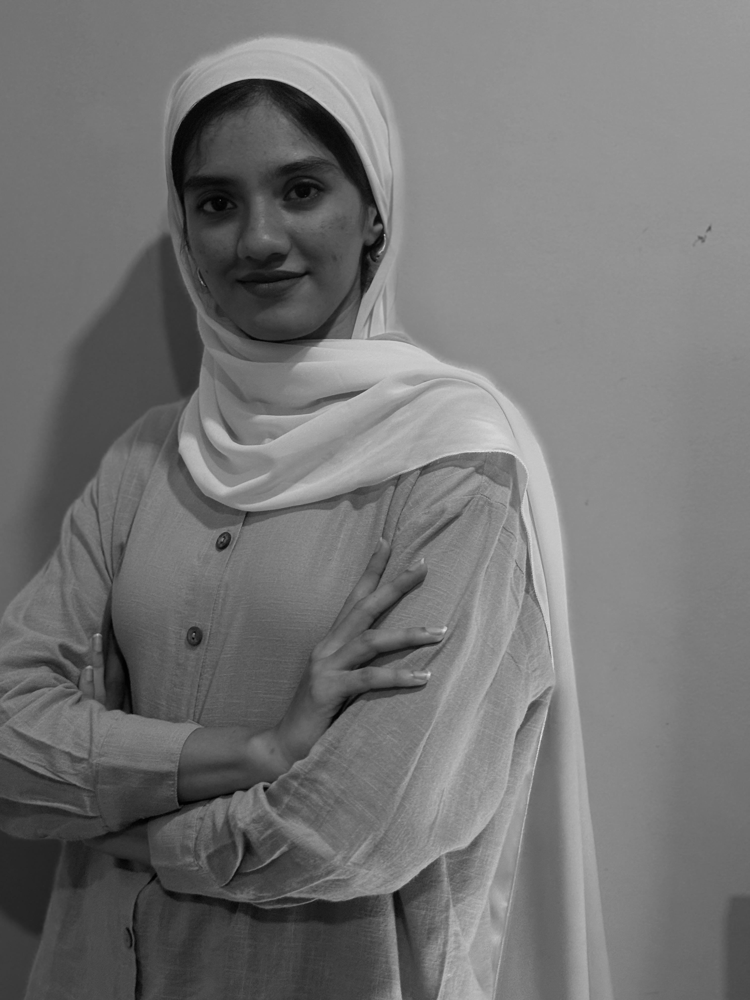

  

  # Afiya Ayman

  ## Welcome to my portfolio!

  I’m glad you’re here. Explore my collection of data projects, where I turn raw data into actionable insights:

  ### 🔍 Featured Projects (Coming Soon)
  - **Coffee Shop Sales Analysis**: Identifying sales trends, customer preferences, and revenue drivers.
  - **10-Day Small Furniture Store Analysis**: Uncovering short-term sales patterns and optimizing inventory management.
  - **Customer Churn Analysis** *(In Progress)*: Predicting customer churn and designing retention strategies.

  ---

  ## 💡 My Skillset

  

    
<strong>SQL</strong> Complex queries, joins, window functions

    
<strong>Python</strong> Pandas, Matplotlib, Seaborn

    
<strong>Power BI</strong> Interactive dashboards

    
<strong>Excel</strong> Formulas, pivot tables

  

  ---

  ## 📬 Contact
  **Email:** afiyaayman01@gmail.com  
  **LinkedIn:** [linkedin.com/in/afiya-ayman-9849202b3](https://www.linkedin.com/in/afiya-ayman-9849202b3)

  ---

  *Stay tuned! More projects and visuals will be added soon.*

